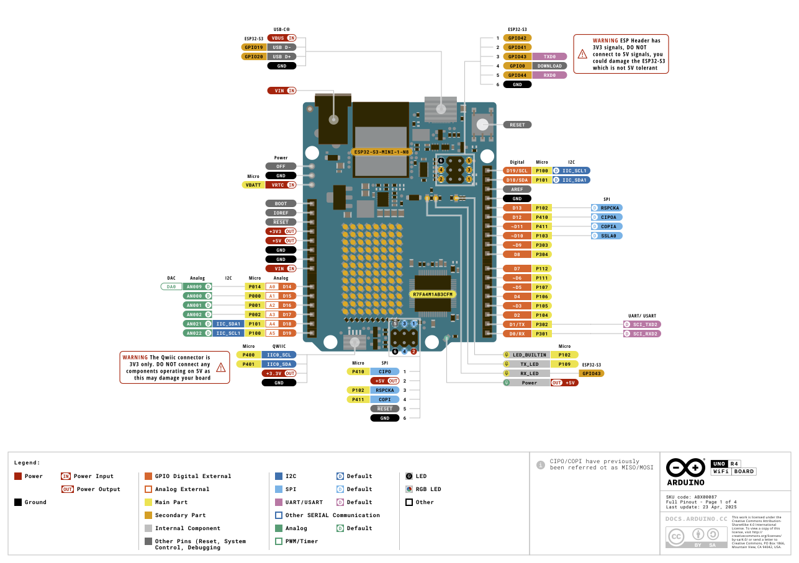
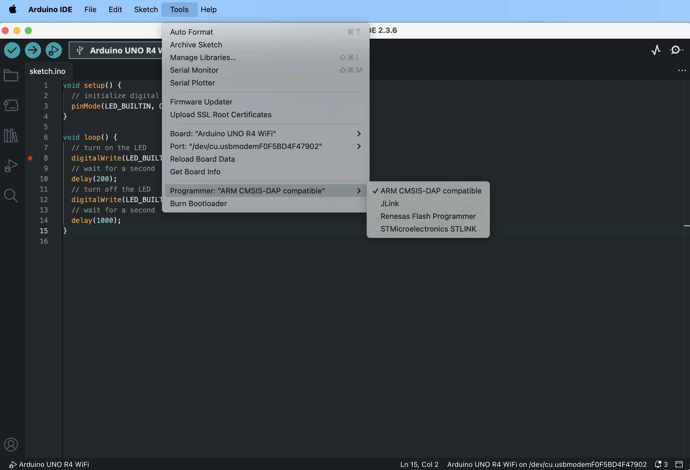

## System Specifications
* **Hardware**: MacBook Pro with Apple M3 Pro
* **System**: macOS 15.4.1
* **Board**: [Arduino UNO R4 WiFi](https://docs.arduino.cc/hardware/uno-r4-wifi/)
* **IDE**: [Arduino IDE 2.3.6](https://www.arduino.cc/en/software/)
* **EDA Tool**: [fritzing](https://fritzing.org/download/), [Fritzing-1.0.5-2176.dmg](fritzing/Fritzing-1.0.5-2176.dmg), [other versions](https://arduinofactory.fr/en/download-fritzing-for-free/#Is_it_legal_to_download_Fritzing_for_free)

## Introduction to Arduino UNO R4
UNO R4 provides modern performance while keeping the familiar form factor of the UNO R3, making it perfect for users who want more power without giving up simplicity or compatibility.

| Feature           | UNO R3 (ATmega328P)         | UNO R4 (Renesas RA4M1)           |
|-------------------|-----------------------------|----------------------------------|
| **Processor**     | 8-bit AVR                   | 32-bit ARM Cortex-M4             |
| **Clock Speed**   | 16 MHz                      | 48 MHz                           |
| **Flash Memory**  | 32 KB                       | 256 KB                           |
| **RAM**           | 2 KB                        | 32 KB                            |
| **USB Interface** | Via ATmega16U2 (serial)     | Native USB                       |
| **Peripherals**   | Basic (ADC, PWM, UART, SPI) | DAC, CAN bus, RTC, more PWM      |
| **Connectivity**  | None                        | Optional WiFi/BLE (UNO R4 WiFi)  |
| **Voltage**       | 5V logic                    | 5V logic (backward compatible)   |
| **Form Factor**   | Standard Arduino UNO        | Same as UNO R3                   |

## Enabled Debugger in IDE

Debugging your Arduino project allows you to dive deep into your code and troubleshoot as well as analyze the code execution. You can gain full access to the microcontroller's internal registers, memory, and variables. 

To access and debug the Arduino's MCU it's important that we set the correct programmer. Select **Tools** > **Programmer** > **ARM CMSIS-DAP compatible**.

## Reference
* [Arduino UNO R4 Wifi](https://docs.arduino.cc/hardware/uno-r4-wifi/)
* [Debugging the Arduino UNO R4 WiFi](https://docs.arduino.cc/tutorials/uno-r4-wifi/debugger/)
* [Built-in Examples](https://docs.arduino.cc/built-in-examples/)

