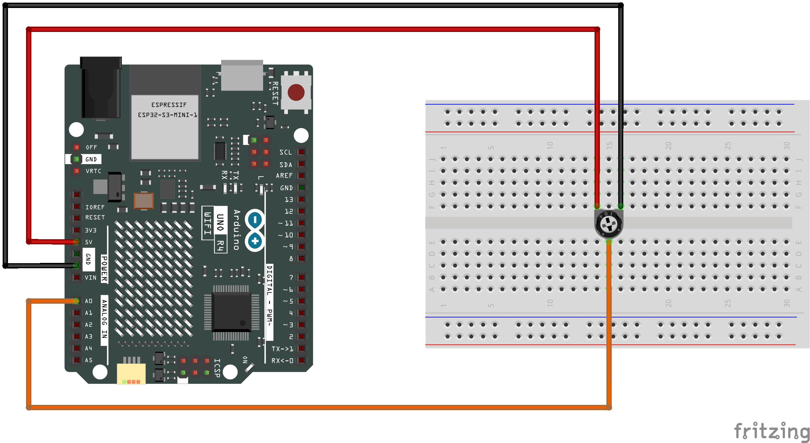

This example shows you how to read analog input from the physical world using a potentiometer. 
A **potentiometer** is a simple mechanical device that provides a varying amount of resistance when its shaft is turned. 
By passing voltage through a potentiometer and into an analog input on your board, it is possible to measure the amount of resistance produced by a potentiometer (or `pot` for short) as an analog value. 

In this example you will monitor the state of your potentiometer after establishing serial communication between your Arduino and your computer running the Arduino Software (IDE).

## Hardware
* Arduino UNO R4 WiFi
* 10k ohm Potentiometer

## Circuit

Connect the three wires from the potentiometer to your board. The first goes from one of the outer pins of the potentiometer to ground. The second goes from the other outer pin of the potentiometer to 5 volts. The third goes from the middle pin of the potentiometer to the analog pin A0.
<div class="flex flex-row gap-3"> 
<div class="flex-none">

|Arduino Board Pin|Potentiometer Pin|
|:----:|:----:|
|`A0`|`Wiper` (middle)|
|`5V`| `VCC` (right)|
|`GND`| `GND` (left)|

</div>
<div class="flex-">



</div>
</div>

### How it Works
* By turning the shaft of the potentiometer, you change the amount of resistance on either side of the wiper, which is connected to the center pin of the potentiometer. 
* This changes the voltage at the center pin. When the resistance between the center and the side connected to 5 volts is close to zero (and the resistance on the other side is close to 10k ohm), the voltage at the center pin nears 5 volts. 
* When the resistances are reversed, the voltage at the center pin nears 0 volts, or ground. This voltage is the analog voltage that you're reading as an input.


## Code

```cpp
void setup() {
  // begin serial communications, at 9600 bits of data per second, between the board and the computer
  Serial.begin(9600);

}

void loop() {
  // read analog value from A0 into variable `sensorValue`
  int sensorValue = analogRead(A0);

  // print this information to your serial monitor window. 
  Serial.println(sensorValue);
}
```

Click `Serial Monitor` button the top right corner(or press `CMD+Shift+M`). 
You should see a steady stream of numbers ranging from `0`-`1023`, correlating to the position of the pot. As you turn your potentiometer, these numbers will respond almost instantly.


## Snapshot
// TODO

## Reference
* [Analog Read Serial](https://docs.arduino.cc/built-in-examples/basics/AnalogReadSerial/)

