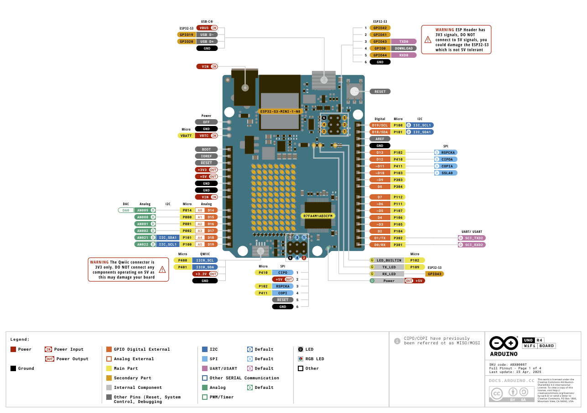

## System Specifications
* Hardware: MacBook Pro with Apple M3 Pro
* System: macOS 15.4.1

## Introduction to Arduino UNO R4
UNO R4 provides modern performance while keeping the familiar form factor of the UNO R3, making it perfect for users who want more power without giving up simplicity or compatibility.

| Feature           | UNO R3 (ATmega328P)         | UNO R4 (Renesas RA4M1)           |
|-------------------|-----------------------------|----------------------------------|
| **Processor**     | 8-bit AVR                   | 32-bit ARM Cortex-M4             |
| **Clock Speed**   | 16 MHz                      | 48 MHz                           |
| **Flash Memory**  | 32 KB                       | 256 KB                           |
| **RAM**           | 2 KB                        | 32 KB                            |
| **USB Interface** | Via ATmega16U2 (serial)     | Native USB                       |
| **Peripherals**   | Basic (ADC, PWM, UART, SPI) | DAC, CAN bus, RTC, more PWM      |
| **Connectivity**  | None                        | Optional WiFi/BLE (UNO R4 WiFi)  |
| **Voltage**       | 5V logic                    | 5V logic (backward compatible)   |
| **Form Factor**   | Standard Arduino UNO        | Same as UNO R3                   |

## 

## Reference
* [Arduino UNO R4 Wifi](https://docs.arduino.cc/hardware/uno-r4-wifi/)
* [Floating Pin Explained](https://www.youtube.com/watch?v=6U9l8U2kPfQ)